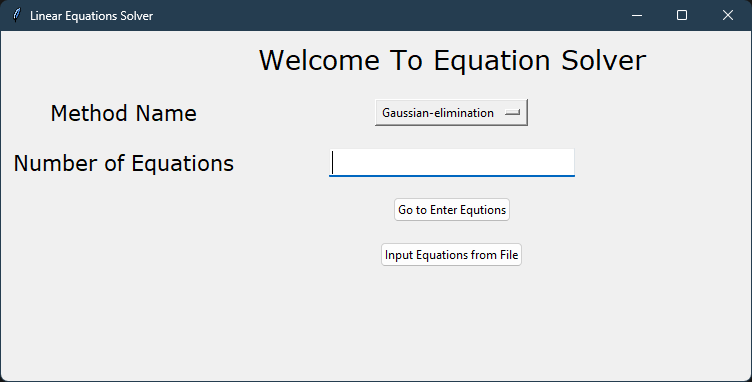

# Linear Equations Solver

A Python-based linear equation solver CLI application that allows a user to input a number of linear equations and choose any one of 4 numerical methods (Gaussian-elimination, LU decomposition, Gaussian-Jordan and Gauss-Seidel), along with their respective parameters, to solve the equations.

This project was developed as part of the course Numerical Analysis in the Spring 2022 semester at the Faculty of Engineering, Alexandria University, under the Computer and Communications Engineering department, supervised by Dr. Zeinab Eid.

## Features

The program contains the following features:

- An interactive GUI that enables the user to enter a set of linear equations.
- Reading from files, following this format:
  - 1st line: number of equations
  - 2nd line: Method Name (e.g. 'Gaussian-elimination')
  - 3rd line --> nth line: equations
  - last line: Space separated initial points (e.g. 1.1 2)
- A dropdown menu to choose a method to solve the given equation.
- Textboxes to enter the precision and the max number of iterations otherwise default values are used, Default Max Iterations = 50, Default Epsilon = 0.00001;
- Display of answer for the chosen method indicating the number of iterations (if exists), execution time, all iterations’ approximate root and precision.
- Test cases are available in the file `test_cases.zip` for the user to try out each method.

## Prerequisites

This project was developed in the following environment:

- PyCharm Community 2023.3.4
- Miniconda
- Python 3.11.5
- matplotlib 3.8.0
- NumPy 1.26.4
- SymPy 1.12

## Installing

1- Clone the repository to your local machine:

```bash
git clone https://github.com/MohEsmail143/linear-equations-solver.git
```

2- Open PyCharm Community.

3- Click on `Run 'main'` button for the file `main.py`. The following window should appear:



## License

This project is licensed under the MIT License - see the [LICENSE.md](LICENSE) file for details.
